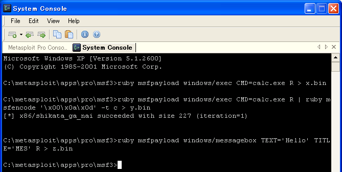

###たのしいバイナリの歩き方
書籍「たのしいバイナリの歩き方」で使用するプログラム一式です。  
右のサイドバーにある「Download ZIP」をクリックするとすべてのファイルをダウンロードできます。  
  
出版社ページ  
http://gihyo.jp/book/2013/978-4-7741-5918-8
  
著者ブログ（書籍には書けなかった内容などを書いてます）  
http://07c00.hatenablog.com/
  
####正誤表
P138,P139のスタックの図において $1,$2,$3 の順序が逆です。  
（正確には $1 と $3 が逆になります）  
  
P145の syscall.hにおいて各行の先頭が #de ne となっています。  
正確には #define です。  
  
また誤植ではありませんが、  
P141の実行例にて gdb 内で python を実行するコマンドは、  
特殊文字が入り組んでおり分かりにくいですが   
`(gdb)r "\`python -c 'print "A"*80'\`"`  
となっています
  
####VisualC++ 2010 Express版でのビルド方法
拡張子.slnはVC++のソリューションファイルです。  
VC++がインストールされていればそのままダブルクリックするだけでOKです。  
その後メニューから デバッグ⇒ソリューションのビルド を選択してください。  
Release or Debugフォルダ以下に実行ファイル一式が作成されます。  
  
####1〜2章のサンプルソースをビルドするときの注意点
chap01とchap02に入っているEXEファイルはASLRをオフに設定しています。  
しかしプロジェクトファイル（ソースコード）については  
ASLRオンのEXEファイルを生成する設定になっています。  
そのため、プロジェクトファイルを開き、  
ソースコードをそのままビルドして作成したEXEファイルを使うと  
本書に書かれている状態とは異なる可能性があります。  
（すでにあるEXEファイルを使うばあいは問題ありません）  
  
ASLRをオフにしたEXEファイルを作成したいばあいは以下のページを見てください。  
http://07c00.hatenablog.com/entry/2013/08/07/033443
  
####プロセスダンプするツールを作りたい
2章でプロセスダンプを行うツール（ワトソン博士など）を解説しましたが、  
それらを作成することもできます。  
  
プロセスダンプするプログラムを作成してみよう！  
http://07c00.hatenablog.com/entry/2013/09/07/015519
  
####3章のFreeBSDとUbuntu環境について
OSごと必要なばあいはそれぞれ以下のURLからダウンロードできます。  
  
FreeBSD-8.3  
http://07c00.com/tmp/FreeBSD_8.3_binbook.zip
  
Ubuntu-12.04  
http://07c00.com/tmp/Ubuntu-12.04_binbook.zip
  
ログインのためのuser/passは書籍（3章）を確認してください。  
Ubuntuで root になる場合は、一度 guest アカウントでログインした後  
sudo su コマンドを実行し root になってください。  
  
起動にはVMWare Playerが必要です。  
http://www.vmware.com/products/player/
  
####P159-P160のcolumnについて
P159の「printf系関数に起因するフォーマットストリングバグ」は  
以下のページで詳細を解説しています。  
興味があれば読んでみてください。  
  
フォーマットストリングバグ（format bug）を試してみる。  
http://07c00.hatenablog.com/entry/2013/08/10/112404
  
####4章で触れているデバッガ作成やAPIフックについて
4章で触れているデバッガ作成やAPIフックについて  
Linux環境でやりたいばあいは以下のページが参考になると思います。  
http://07c00.hatenablog.com/entry/2013/08/31/142001  
http://07c00.hatenablog.com/entry/2013/09/02/003629
  
####P226で触れられているCVE-2009-0927の解析動画
本書ではExploitの詳細にはほとんど触れていませんが、  
以下の動画でExploitのちょっとした解析をやっています。  
興味があれば見てみてください。  
  
Introducing of Security Camp 2013 "Software security class"  
http://www.youtube.com/watch?v=eUslcqff6_k
  
####P228-P229のcolumnについて
P229の「msfpayloadを使ってWindows環境で動作するshellcodeを作成」で  
画像（コンソール）の文字が潰れてよく見えないかもしれません。  

  
